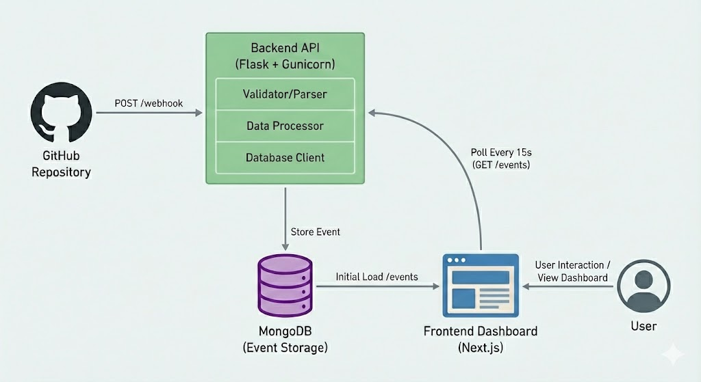

# System Architecture

<!-- GitHub Repository → POST /webhook → Backend API → MongoDB → GET /events → Frontend Dashboard -->

## Component Breakdown

### Backend (Flask + Gunicorn)

- **Validator/Parser:** Handles different GitHub event types (PUSH, PR, MERGE)
- **Data Processor:** Structures and enriches event data
- **Database Client:** MongoDB connection management (singleton pattern)
- **Logging:** Structured logs for production debugging

### Database (MongoDB)

- Flexible schema for varying webhook payloads
- Stores full event data with timestamps
- Indexed for fast queries

### Frontend (Next.js)

- Polls backend every 15 seconds
- Real-time UI updates with animations
- Event timeline with filtering
- Statistics dashboard

